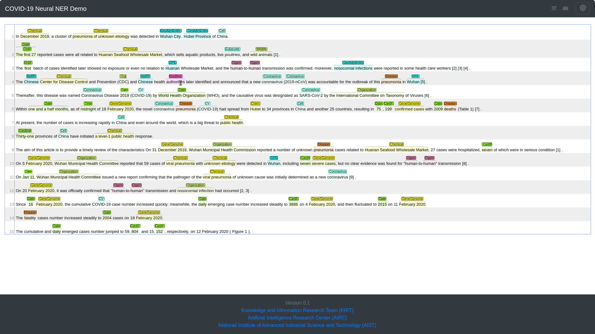

# **BENNERD**: **B**ERT-based **E**xhaustive **N**eural **N**amed **E**ntity **R**ecognition and **D**isambiguation

# Overview
On this page, we present our recent research related to the coronavirus disease in 2019.
Our main objective of this work is to propose a biomedical entity linking system and then provide a web interface for end-users to facilitate and accelerate COVID-19 studies.
The results of our method also reported on this page and compared to several previous works.
We also release our manually annotated test- and UMLS-based test sets that are used in this research as part of our effort to support the community in studying the coronavirus disease.

# Background
In response to the coronavirus disease 2019 (COVID-19) for global research community to apply recent advances in natural language processing (NLP), COVID-19 Open Research Dataset ([CORD-19](https://www.kaggle.com/allen-institute-for-ai/CORD-19-research-challenge)) is an emerging research challenge with a resource of over 181,000 scholarly articles that are related to the infectious disease COVID-19 caused by severe acute respiratory syndrome coronavirus 2 (SARS-CoV-2). To facilitate COVID-19 studies, since named entity recognition (NER) is considered a fundamental step in text mining system, [data mining group](http://dm1.cs.uiuc.edu) of [CS@UIUC](https://cs.illinois.edu) has created [CORD-NER](https://uofi.app.box.com/s/k8pw7d5kozzpoum2jwfaqdaey1oij93x) dataset with comprehensive NE annotations. The annotations are based on distant or weak supervision. The [CORD-NER](https://uofi.app.box.com/s/k8pw7d5kozzpoum2jwfaqdaey1oij93x) dataset includes 29,500 documents from the [CORD-19](https://www.kaggle.com/allen-institute-for-ai/CORD-19-research-challenge) corpus. 

## Corpora Link
- [CORD-19](https://www.kaggle.com/allen-institute-for-ai/CORD-19-research-challenge)
- [CORD-NER](https://uofi.app.box.com/s/k8pw7d5kozzpoum2jwfaqdaey1oij93x)
 
# BENNERD Description
In this work, we present a BERT-based Exhaustive Neural Named Entity Recognition and Disambiguation (BENNERD) system by addressing [CORD-NER](https://uofi.app.box.com/s/k8pw7d5kozzpoum2jwfaqdaey1oij93x) data set. The entity disambiguation (ED) or entity normalization (EN) is a.k.a entity linking (EL) task. The objective of this work is to facilitate recent pandemic of corona virus disease 2019 (COVID-19) research that mainly covers biomedical domain, especially new entity types (e.g., coronavirus, viral proteins, immune responses) by addressing [CORD-NER](https://uofi.app.box.com/s/k8pw7d5kozzpoum2jwfaqdaey1oij93x) dataset. The BENNERD system is composed of four models: **NER** that enumerates [exhaustively](https://www.aclweb.org/anthology/D18-1309.pdf) all possible spans as potential entity mentions and classifies them into entity types, masked language model as **BERT**, **candidate generation model** to find a list of candidate entities, and **candidate ranking model** to disambiguate the entity for concept indexing. 

# [BENNERD DEMO](http://prm-ezcatdb.cbrc.jp/bennerd/)
The BENNERD system provides a [web interface](http://prm-ezcatdb.cbrc.jp/bennerd/) to facilitate the process of text annotation and its disambiguation without any training for end users. In our demo, users can input a plain text of any biomedical document to extract entities with their corresponding types and UMLS CUI(s) in BRAT format. It also provides a feature to filter out some of the specific entities by their types via a simple checkbox list (the setting button on the top right of page).

Users can access our demo via [http://prm-ezcatdb.cbrc.jp/bennerd/](http://prm-ezcatdb.cbrc.jp/bennerd/).



# Sample Data Format of Extended CORD-NER 
Examples of annotation for an entity (**T**), a normalization (**N**) are shown in the following. Text-bound annotation identifies a specific span of text and assigns it a type. In text-bound annotation (**T1**) of a span “**Angiotensin-converting enzyme 2**”,  **0** denotes start-offset and **31** denotes end-offset of the annotation span, where type is **GENE_OR_GENOME**. The normalization annotation (**N1**) is attached to the text-bound annotation (**T1**) which is associated with the unified medical language system ([UMLS](https://www.nlm.nih.gov/research/umls/licensedcontent/umlsknowledgesources.html)) entry with the [UMLS](https://www.nlm.nih.gov/research/umls/licensedcontent/umlsknowledgesources.html) concept unique identifier (CUI) as **C0960880**. 
```
    T1	GENE_OR_GENOME 0 31	Angiotensin-converting enzyme 2
    N1	Reference T1	UMLS:C0960880
    T2	GENE_OR_GENOME 33 37	ACE2
    N2	Reference T2	UMLS:C1422064
    T3	CORONAVIRUS 44 54	SARS-CoV-2
    N3	Reference T3	UMLS:C5203676
    T4	CHEMICAL 55 63	receptor
    N4	Reference T4	UMLS:C0597357
    T5	CORONAVIRUS 120 130	SARS-CoV-2
    N5	Reference T3	UMLS:C5203676
    T6	EVOLUTION 158 170	phylogenetic
    N6	Reference T6	UMLS:cui_less
    T7	WILDLIFE 195 198	bat
    N7	Reference T7	UMLS:C1412726
    T8	CORONAVIRUS 214 224	SARS-CoV-2
    N8	Reference T3	UMLS:C5203676
    T9	NORP 259 277	intermediate hosts
    N9	Reference T9	UMLS:cui_less
    T10	CORONAVIRUS 282 292	SARS-CoV-2
    N10	Reference T3	UMLS:C5203676
```

## Test Sets Link
We release the UMLS-based and manually annotated test sets and are available from the following links. 
* [UMLS-based Test Set](https://github.com/aistairc/CORD-NER/blob/master/data/UMLS_based_Test_Set.zip)
* [Manually Annotated Test Set](https://github.com/aistairc/CORD-NER/blob/master/data/Manually_Annotated_Test_Set.zip)

It is worth to mention that both [UMLS-based Test Set](https://github.com/aistairc/CORD-NER/blob/master/data/UMLS_based_Test_Set.zip) and [Manually Annotated Test Set](https://github.com/aistairc/CORD-NER/blob/master/data/Manually_Annotated_Test_Set.zip) are based on the orginal offsets of [CORD-NER](https://uofi.app.box.com/s/k8pw7d5kozzpoum2jwfaqdaey1oij93x) dataset.

# BENNERD System
BENNERD system mainly comprises two platforms: [BENNERD web interface](http://prm-ezcatdb.cbrc.jp/bennerd/) and BENNERD back-end server. The overall workflow of the BENNERD system is illustrated as below.


## [BENNERD web interface](http://prm-ezcatdb.cbrc.jp/bennerd/)
In [BENNERD web interface](http://prm-ezcatdb.cbrc.jp/bennerd/), the user interface contains input panel, load a sample tab, annotation tab, gear box tab, and .TXT and .ANN tabs. For a given text from users or loading a sample text from a sample list, the annotation tab will show the annotations with the text based on best NER- and EL-based training model. Different colors represent different entity types and, when the cursor floats over a coloured box representing an entity above text, the corresponding concept unique identifier (CUI) on the UMLS is shown. Users can save the machine readable text and annotation files as .txt and .ann where the .ann annotation file provides standoff annotation output in [brat](https://brat.nlplab.org) format.

## BENNERD Back-end
The BENNERD back-end is for storing tools (e.g., NER, EL) that transform into a pipeline. It is composed of BERT-based exhaustive neural named entity recognition (NER) model and the prediction of NER model then fed to entity linking (EL) model that disambiguate the predicted entities by addressing candidate generation model (to find a list of candidate entities) and candidate ranking model.

### Neural Named Entity Recognition
Named entity recognition (NER) is a task of finding entities with specific semantic types such as Protein, Cell, and RNA in text. We build neural NER model, based on the [BERT](https://www.aclweb.org/anthology/N19-1423.pdf) model. The layer receives subword sequences and assigns contextual representations to the subwords via BERT. We generate mention candidates based on the same idea as the [span-based model](https://www.aclweb.org/anthology/D18-1309.pdf).

#### BENNERD NER Performances using Different Pre-trained BERT Models

Since our NER model is mainly based on BERT architecture and there are dozen of pre-trained BERT models on different corpora, we tested the performance of BENNERD NER on some of the well-known pre-trained BERT models for the biomedical domain. We also applied the same training setting to make sure that the results are comparable.

```
    --------------------------------------------------------------------------------
     Pre-trained BERT
          Model                Development-set                      Test-set
                        ----------------------------    ----------------------------       
                        Precision   Recall    F1(%)     Precision   Recall    F1(%)
    ------------------  ---------   ------  --------    ---------   ------  --------
    ClinicalCovid BERT    84.62     86.43     85.52       82.83      83.23    83.03
    SciBERT               84.03     87.05     85.51       82.16      83.81    82.98
    Covid BERT Base       78.31     66.80     72.10       77.44      66.80    71.73
    --------------------------------------------------------------------------------
 ```
* [ClinicalCovid BERT](https://github.com/manueltonneau/covid-berts) is a BERT model trained on scientific corpora, namely [ClinicalBERT](https://github.com/EmilyAlsentzer/clinicalBERT) and [BioBERT](https://github.com/dmis-lab/biobert).
* [SciBERT](https://github.com/allenai/scibert) is trained on papers from the corpus of [semanticscholar.org](https://www.semanticscholar.org).
* [Covid BERT Base](https://huggingface.co/deepset/covid_bert_base) is based on fine-tuned a BERT base model on the [CORD-19](https://www.kaggle.com/allen-institute-for-ai/CORD-19-research-challenge) corpus. 

#### Categorical Performances Based on All Categories

We show the categorical performances of NER model trained on [ClinicalCovid BERT](https://github.com/manueltonneau/covid-berts) over the [CORD-NER](https://uofi.app.box.com/s/k8pw7d5kozzpoum2jwfaqdaey1oij93x) dataset.

    ----------------------------------------------------------------------------------------------
    Label                               Precision   Recall   F1-score(%)   #TPs    #Preds   #Golds
    ----------------------------------  ---------   ------   -----------   ------  -------  ------
    ANATOMICAL_STRUCTURE                  76.62      76.62      76.62       390      509       509
    ARCHAEON                              96.30      96.30      96.30        52       54        54
    BACTERIUM                             79.80      90.51      84.82       391      490       432
    BODY_PART_ORGAN_OR_ORGAN_COMPONENT    87.03      84.79      85.90      3517     4041      4148
    BODY_SUBSTANCE                        95.56      96.72      96.14      1357     1420      1403
    CARDINAL                              82.36      90.94      86.44     54376    66021     59793
    CELL                                  82.24      87.52      84.80     15278    18578     17456
    CELL_COMPONENT                        83.03      81.41      82.21      9789    11790     12024
    CELL_FUNCTION                         95.33      97.66      96.48      1797     1885      1840
    CELL_OR_MOLECULAR_DYSFUNCTION         98.91      98.91      98.91      2267     2292      2292
    CHEMICAL                              83.55      84.60      84.07     94459   113056    111650
    CORONAVIRUS                           98.46      98.94      98.70     21928    22271     22162
    DAILY_OR_RECREATIONAL_ACTIVITY        97.20      98.85      98.02      1460     1502       147
    DATE                                  80.24      83.79      81.98     30231    37675     36080
    DIAGNOSTIC_PROCEDURE                  94.72      96.57      95.64       592      625       613
    DISEASE_OR_SYNDROME                   84.85      84.99      84.92     30717    36202     36140
    EDUCATIONAL_ACTIVITY                  90.91      93.75      92.31        30       33        32
    EUKARYOTE                             89.68      95.04      92.28      5268     5874      5543
    EVENT                                 40.79      17.71      24.70        31       76       175
    EVOLUTION                             97.16      98.46      97.80      5301     5456      5384
    EXPERIMENTAL_MODEL_OF_DISEASE         96.05      97.33      96.69       146      152       150
    FAC                                   42.75      10.87      17.34        56      131       515
    FOOD                                  89.12      93.40      91.21       467      524       500
    GENE_OR_GENOME                        76.07      74.83      75.45     71833    94426     95993
    GOVERNMENTAL_OR_REGULATORY_ACTIVITY   65.76      99.18      79.08       121      184       122
    GPE                                   78.40      74.71      76.51      7020     8954      9396
    GROUP                                 98.48      99.25      98.86     11104    11275     11188
    GROUP_ATTRIBUTE                       88.10      100.0      93.67        74       84        74
    HUMAN-CAUSED_PHENOMENON_OR_PROCESS    95.88      98.94      97.38        93       97        94
    IMMUNE_RESPONSE                       97.29      99.42      98.35      1725     1773      1735
    INDIVIDUAL_BEHAVIOR                   84.50      93.09      88.59       229      271       246
    INJURY_OR_POISONING                   93.60      95.12      94.35       117      125       123
    LABORATORY_OR_TEST_RESULT             95.63      97.47      96.54       810      847       831
    LABORATORY_PROCEDURE                  93.24      95.43      94.32      4030     4322      4223
    LANGUAGE                              78.57      61.11      68.75        22       28        36
    LAW                                   43.98      22.51      29.78        95      216       422
    LIVESTOCK                             96.67      97.26      96.96      2091     2163      2150
    LOC                                   70.63      43.34      53.72       267      378       616
    MACHINE_ACTIVITY                      97.35      96.08      96.71       147      151       153
    MATERIAL                              94.80      90.46      92.58       237      250       262
    MOLECULAR_FUNCTION                    96.31      97.91      97.10      4930     5119      5035
    MONEY                                 50.97      32.99      40.05       158      310       479
    NORP                                  70.48      70.79      70.63      1294     1836      1828
    ORDINAL                               85.55      95.82      90.39      4220     4933      4404
    ORG                                   66.33      50.37      57.26      9289    14004     18440
    ORGANISM                              85.80      83.32      84.54      9015    10507     10820
    ORGAN_OR_TISSUE_FUNCTION              89.84      94.01      91.88       345      384       367
    PERCENT                               66.33      42.76      52.00        65       98       152
    PERSON                                56.02      51.16      53.48      4027     7188      7872
    PHYSICAL_SCIENCE                      96.80      93.08      94.90       121      125       130
    PRODUCT                               52.60      35.28      42.23       930     1768      2636
    QUANTITY                              71.15      73.38      72.25      3095     4350      4218
    RESEARCH_ACTIVITY                     98.63      98.75      98.69      2600     2636      2633
    SIGN_OR_SYMPTOM                       95.07      96.39      95.73      1310     1378      1359
    SOCIAL_BEHAVIOR                       95.73      98.18      96.94       538      562       548
    SUBSTRATE                             95.99      98.46      97.21      1341     1397      1362
    THERAPEUTIC_OR_PREVENTIVE_PROCEDURE   97.28      98.86      98.06      7551     7762      7638
    TIME                                  86.67      85.33      86.00      1437     1658      1684
    TISSUE                                78.10      74.66      76.34      4223     5407      5656
    VIRAL_PROTEIN                         89.39      91.09      90.23      1053     1178      1156
    VIRUS                                 89.18      95.09      92.04      5383     6036      5661
    WILDLIFE                              98.43      97.56      97.99      1438     1461      1474
    WORK_OF_ART                           34.75      14.44      20.40        41      118       284
    ----------------------------------------------------------------------------------------------
  
#### Performance Comparison with State-of-the-art Models on [CORD-NER](https://uofi.app.box.com/s/k8pw7d5kozzpoum2jwfaqdaey1oij93x) Dataset

    ---------------------------------------------------------------------------------------------
        Model                  Gene                    Chemical                  Disease
                     ------------------------  ------------------------  ------------------------     
                     Precision  Recall  F1(%)  Precision  Recall  F1(%)  Precision  Recall  F1(%)
    ---------------  ---------  ------  -----  ---------  ------  -----  ---------  ------  -----
    SciSpacy*          91.48    82.06   86.51    64.66    39.81   49.28     8.11     2.75    4.11
    (BIONLP13CG)
    ---------------  ------------------------  ------------------------  ------------------------
    SciSpacy*            -        -       -      86.97    51.86   64.69     80.31   59.65   68.46
    (BC5CDR)
    ---------------  ------------------------  ------------------------  ------------------------
    CORD-NER System    82.14    74.68   72.23    82.93    75.22   78.89     75.73   68.42   71.89
    ---------------------------------------------------------------------------------------------

- [SciSpacy (BIONLP13CG)](https://s3-us-west-2.amazonaws.com/ai2-s2-scispacy/releases/v0.2.5/en_ner_bionlp13cg_md-0.2.5.tar.gz) is a [SciSpacy](https://allenai.github.io/scispacy/) NER model trained on the BIONLP13CG corpus.
- [SciSpacy (BC5CDR)](https://s3-us-west-2.amazonaws.com/ai2-s2-scispacy/releases/v0.2.5/en_ner_bc5cdr_md-0.2.5.tar.gz) is a [SciSpacy](https://allenai.github.io/scispacy/) NER model trained on the BC5CDR corpus.
- *Note: The results of SciSpacy are based on randomly picked 1000 sentences from [CORD-NER](https://uofi.app.box.com/s/k8pw7d5kozzpoum2jwfaqdaey1oij93x) dataset.

#### BENNERD Performances based on Indirect comparison with State-of-the-art Models on [CORD-NER](https://uofi.app.box.com/s/k8pw7d5kozzpoum2jwfaqdaey1oij93x) Dataset
Performance comparison of our model BENNERD on three major biomedical entity types in CORD-19 corpus. Since the manually annotated CORD-NER test set is not publicly available, we can not directly compare our system performances on the gene, chemical, and disease entity types. Instead, here we  show  the  performance  of gene, chemical, and disease based on our 5,000 test set.

    ----------------------------------------------------------------------------------------------
        Model                   Gene                    Chemical                   Disease
                      ------------------------  ------------------------  ------------------------       
                      Precision  Recall  F1(%)  Precision  Recall  F1(%)  Precision  Recall  F1(%)
    ---------------   ---------  ------  -----  ---------  ------  -----  ---------  ------  -----
    BENNERD             76.07     74.8   75.45    83.55     84.60  84.07    84.85     84.9   84.92
    ----------------------------------------------------------------------------------------------

### Entity Linking
The [CORD-NER](https://uofi.app.box.com/s/k8pw7d5kozzpoum2jwfaqdaey1oij93x) dataset gives a shed on entity recognition system, but it does not address entity linking (EL) task which is important to address COVID-19 research.  For example, the mention SARS-CoV-2 needs to be disambiguated. Since the term SARS-CoV-2 in this sentence refers to a virus, it should be linked to an entry of a virus in the knowledge base (KB), not to an entry of ‘SARS-CoV-2 vaccination’, which corresponds to therapeutic or preventive procedure to prevent a disease. To address EL, we implement **candidate generation model** to find a list of candidate entities in the [UMLS](https://www.nlm.nih.gov/research/umls/licensedcontent/umlsknowledgesources.html) KB for linking and **candidate ranking model** to disambiguate the entity for concept indexing.

### Entity Linking Performances on Test Sets
We are the first to perform entity linking (EL) task on [CORD-19](https://www.kaggle.com/allen-institute-for-ai/CORD-19-research-challenge) data set. To judge the EL system performances, we created two test sets: 1. [UMLS-based Test Set](https://github.com/aistairc/CORD-NER/blob/master/data/UMLS_based_Test_Set.zip) 2. [Manually Annotated Test Set](https://github.com/aistairc/CORD-NER/blob/master/data/Manually_Annotated_Test_Set.zip). 

#### [UMLS-based Test Set](https://github.com/aistairc/CORD-NER/blob/master/data/UMLS_based_Test_Set.zip)
[CORD-NER](https://uofi.app.box.com/s/k8pw7d5kozzpoum2jwfaqdaey1oij93x)  dataset  comprises  only  NER  task. To solve the EL task, we expand this dataset by leveraging a CUI for each mention in the [CORD-NER](https://uofi.app.box.com/s/k8pw7d5kozzpoum2jwfaqdaey1oij93x) dataset. We use the most recent 
[UMLS version 2020AA release](https://www.nlm.nih.gov/research/umls/licensedcontent/umlsknowledgesources.html) that includes coronavirus-related concepts. To create a dataset for EL, we use a dictionary matching approach based on exact match using [UMLS](https://www.nlm.nih.gov/research/umls/licensedcontent/umlsknowledgesources.html) KB. [CORD-NER](https://uofi.app.box.com/s/k8pw7d5kozzpoum2jwfaqdaey1oij93x) includes 10,470,248 mentions, among which 6,794,126 and 3,676,122 mentions are respectively present and absent in the [UMLS](https://www.nlm.nih.gov/research/umls/licensedcontent/umlsknowledgesources.html). Therefore, the entity coverage ratio of [CORD-NER](https://uofi.app.box.com/s/k8pw7d5kozzpoum2jwfaqdaey1oij93x) over the [UMLS](https://www.nlm.nih.gov/research/umls/licensedcontent/umlsknowledgesources.html) is 64.89%. We annotate the entity mentions that are not found in the [UMLS](https://www.nlm.nih.gov/research/umls/licensedcontent/umlsknowledgesources.html) with CUI_LESS. Finally we augment the [CORD-NER](https://uofi.app.box.com/s/k8pw7d5kozzpoum2jwfaqdaey1oij93x) dataset with CUI for each correspondence mention. To evaluate the EL performance on [CORD-NER](https://uofi.app.box.com/s/k8pw7d5kozzpoum2jwfaqdaey1oij93x), 302,166 mentions are assigned for 5,000 test set. We call this UMLS-based test set.

#### Entity Linking Performances of BENNERD on [UMLS-based Test Set](https://github.com/aistairc/CORD-NER/blob/master/data/UMLS_based_Test_Set.zip)
We show the EL performances on [UMLS-based test set](https://github.com/aistairc/CORD-NER/blob/master/data/UMLS_based_Test_Set.zip). We report Accuracy@n, where n = 1, 10, 20, 30, 40, 50. Accuracy@1, gold candidate was ranked highest. Accuracy@{10, 20, 30, 40, 50} indicates, gold candidate was in top 10, 20, 30, 40 or in 50 predictions of the candidate ranker.
```
    -------------------------------------------------------------------------------------------
    Model                                            UMLS-based Test Set
                                     ----------------------------------------------------------       
                                        A@1       A@2       A@3       A@4       A@5      A@6(%)
    -----------------------------    --------  --------  --------  --------  --------  --------
    BENNERD + NER's Prediction         27.61     44.56     49.74     51.88     53.08     54.19
    BENNERD + NER's Gold               29.78     48.33     53.89     56.22     57.53     58.74
    BENNERD + NER's True Positive      30.31     48.91     54.60     56.95     58.27     59.49
    -------------------------------------------------------------------------------------------
```
#### [Manually Annotated Test Set](https://github.com/aistairc/CORD-NER/blob/master/data/Manually_Annotated_Test_Set.zip)
In addition with the [UMLS-based test set](https://github.com/aistairc/CORD-NER/blob/master/data/UMLS_based_Test_Set.zip), we assigned a biologist to annotate 1,000 random sentences based on chemical, disease, and gene types along with its corresponding CUI to create a [manually annotated test set](https://github.com/aistairc/CORD-NER/blob/master/data/Manually_Annotated_Test_Set.zip). 

#### Entity Linking Performances of BENNERD on [Manually Annotated Test Set](https://github.com/aistairc/CORD-NER/blob/master/data/Manually_Annotated_Test_Set.zip)
We show the EL performances on [manually annotated test set](https://github.com/aistairc/CORD-NER/blob/master/data/Manually_Annotated_Test_Set.zip).

```
    ------------------------------------------------------------------------------
    Model                               Manually Annotated Test Set
                         ---------------------------------------------------------       
                           A@1       A@2       A@3       A@4       A@5      A@6(%)
    ------------------   -------   -------   -------   -------   -------   -------
    BENNERD               24.27     42.95     47.07     48.81     50.00     50.92
    ------------------------------------------------------------------------------
```
# Summary
We  presented  the  **BENNERD**  system  for  entity linking, hoping that we can bring insights for the COVID-19 studies on making scientific discoveries.

# Acknowledgement:
This work is based on results obtained from a project commissioned by the Public/Private R&D Investment Strategic Expansion PrograM (PRISM)


